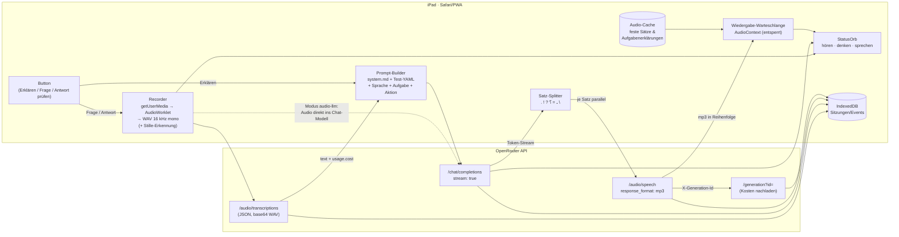

# PLAN.md: KI-Sprachassistenz für gering literalisierte DaZ-Lernende (Technology Preview, iPad)

> Stand der OpenRouter-Recherche: 27.09.2026 (Doku unter openrouter.ai/docs und Live-Abfrage von `/api/v1/models`).

## 0. Kontext und Ziel

Gering literalisierte DaZ-Lernende bearbeiten in der Alpha-Lernberatung (Markov et al. 2015; Franz dos Santos 2023)
handlungsorientierte Diagnostik-Tests auf Papier, orientiert an LASLLIAM. Viele können auch in der Erstsprache kaum lesen.
Eine iPad-App soll sie **per Sprache in ihrer Muttersprache** begleiten: Sie erklärt die Aufgabe, erklärt deutsche Wörter,
beantwortet Fragen und nimmt die Antwort zur Bewertung entgegen. Die Lernbegleitung ist nur im Zweifel in der Nähe.
Die App sieht das Papier nicht und kennt die Aufgabe nur über die Navigation.

Ziel ist eine **Technology Preview**: schnell lauffähig, einfach und eindrucksvoll in der Demo. Alle Stufen
(STT, LLM, TTS) laufen über OpenRouter und sind per Konfigurationsdatei austauschbar. Jede Interaktion wird mit
Latenz und Kosten protokolliert.

**Getroffene Entscheidungen (Rückfragen vom 27.09.2026):**
- Die Antwort wird **nur gesprochen bzw. buchstabiert** (Foto per Vision bleibt eine Erweiterung, siehe §10).
- Hosting über **GitHub Pages**.
- Die Sitzung startet die **Lernbegleitung**: Sie gibt das Pseudonym ein, wählt den Test und gibt dann das iPad weiter.
- Die Testinhalte sind **selbst erstellte Testdaten ohne DSGVO-relevante Daten**. Ein öffentliches Repo und GitHub Pages sind damit in Ordnung.

---

## 1. Architekturentscheidung und Tech-Stack

**Entscheidung: Web-App (PWA-light) in Safari, über „Zum Home-Bildschirm“, ohne native App.**

Begründung:
- Alle nötigen Bausteine gibt es in iPadOS-Safari: `getUserMedia`, Web Audio/AudioWorklet, Screen Wake Lock
  (ab iPadOS 16.4, im Home-Screen-Modus zuverlässig ab 18.4), IndexedDB, Kamera (für spätere Erweiterungen) und `fetch` mit Streaming (SSE).
- Man braucht weder Xcode noch einen Developer-Account oder TestFlight. Ein Update ist ein `git push`.
- Mit nativem SwiftUI gäbe es *keinen* entscheidenden Vorteil. Man bekäme eine stabilere Audio-Session und dauerhafte
  Mikrofon-Berechtigung, müsste dafür aber Build, Signing und Verteilung in Kauf nehmen. Die Safari-Fallstricke lassen sich lösen (§6).
- **Bewusst ohne Service Worker:** Offline ist nicht nötig, und ein SW würde nur veraltete Test- und Config-Dateien
  riskieren. Für „Zum Home-Bildschirm“ reichen Manifest, `apple-touch-icon` und die Meta-Tags.

**Stack (bewusst klein):**
| Zweck | Wahl |
|---|---|
| Build/Dev | Vite + TypeScript |
| UI | Preact + `@preact/signals` (klein, React-ähnlich, einfacher Zustandsautomat für Screens) |
| Konfig/Tests | YAML-Dateien unter `public/`, geparst mit `js-yaml` zur Laufzeit |
| Speicherung | IndexedDB über `idb-keyval` (Sitzungen, Overrides, API-Key, Audio-Cache) |
| Audio | eigenes kleines Modul: AudioWorklet → 16-kHz-Mono-WAV; ein gemeinsamer `AudioContext` für die Wiedergabe |
| KI | direkte `fetch`-Aufrufe an `https://openrouter.ai/api/v1/...` (CORS erlaubt), kein SDK |
| Hosting | GitHub Pages über GitHub Action (Vite `base` = Repo-Name) |
| Tools | `tools/voice-matrix.mjs` (Node): rendert Testsätze pro Sprache × TTS-Modell als MP3 plus Hörseite |

**Projektstruktur (Zielbild):**
```
public/
  config/app.yaml            # globale Defaults: Modelle, Pipeline, Flags, Admin-PIN
  config/languages.yaml      # Sprachen inkl. Modell-Overrides, Stimme, RTL, Begrüßungstext
  prompts/system.md          # Systemprompt-Template (Platzhalter, siehe §4)
  tests/index.yaml           # Liste der verfügbaren Tests
  tests/anmeldeformular.yaml
  tests/wort-bild-alltag.yaml
src/
  app.tsx                    # Screen-Zustandsautomat
  screens/  Start, Language, Task, Admin (Tabs), VoiceLab
  ui/       StatusOrb (hören/denken/sprechen), BigButton, Icons
  audio/    recorder.ts, wav.ts, vad.ts, player.ts (Unlock + Warteschlange)
  ai/       openrouter.ts (fetch+SSE), stt.ts, llm.ts, tts.ts, pipeline.ts (Satz-Splitter, Orchestrierung), prompt.ts
  config/   loader.ts (YAML + lokale Overrides), types.ts
  log/      db.ts, session.ts, export.ts (JSON/CSV), costs.ts
tools/voice-matrix.mjs
.github/workflows/pages.yml
```

---

## 2. Datenfluss Audio → STT → LLM → TTS



**Zwei Pipeline-Modi, pro Sprache konfigurierbar:**
- `cascade` (Standard): STT-Endpoint → Text → LLM. Gut nachvollziehbar, Transkript sauber protokolliert.
- `audio-llm`: Das WAV geht als `input_audio` direkt an ein audiofähiges Chat-Modell (z. B. `google/gemini-3.8-flash`).
  Das Modell gibt zuerst die Zeile `TRANSKRIPT: …` aus, danach die Antwort. Das spart eine Stufe (Latenz) und
  ist bei seltenen Sprachen (Tigrinya, Kurdisch) und bei Code-Switching zwischen Muttersprache und deutschen Wörtern/Buchstaben
  möglicherweise **robuster** als dedizierte STT-Modelle. Welcher Modus besser ist, wird im Sprachlabor pro Sprache entschieden.

**Latenz-Strategie:**
1. Das LLM streamt (SSE). Der Satz-Splitter löst ab dem ersten vollständigen Satz einen TTS-Request aus.
   Folgesätze laufen parallel, die Wiedergabe bleibt in Reihenfolge. Der erste Ton kommt nach etwa (STT + LLM bis Satz 1 + TTS Satz 1) statt nach der ganzen Kette.
2. Der Prompt erzwingt **kurze Antworten** (2–4 kurze Sätze), und der erste Satz soll sehr kurz sein.
3. Feste Sätze (Begrüßung, „Ich höre zu“, „Danke“, Fehlermeldungen) werden **einmalig vorab erzeugt** und gecacht
   (Admin-Button „Audios vorbereiten“).
4. **„Aufgabe erklären“ wird pro (Test, Aufgabe, Sprache, Modellkombination) gecacht.** Das ist sofort abspielbar,
   billig und für die Forschung methodisch sauberer, weil alle Lernenden dieselbe Erklärung hören. Per Flag abschaltbar.
5. Ein sprachunabhängiger StatusOrb begleitet jede Phase (§5).

---

## 3. Datenformate

### 3.1 Test (YAML, eine Datei pro Test)
Grundregel: **Alles, was auf dem Papier sichtbar ist, muss als Text in der Datei stehen, auch Bilder als Beschreibung.**
Das LLM kennt das Papier nur so.

```yaml
id: anmeldeformular-v1
version: 1
titel: "Anmeldeformular ausfüllen"
domaene: "Auf dem Amt"
laslliam: ["Schreiben: persönliche Angaben in ein einfaches Formular eintragen"]  # optional, für später
beschreibung_papier: |
  Ein Blatt mit einem einfachen Formular "Anmeldung". Oben ein Bild von einem Amt.
  Darunter fünf Zeilen mit Feldern und Linien zum Schreiben.
hilfe:
  erlaubt:            # wird ins Template eingesetzt
    - "Die Aufgabenstellung in der Muttersprache erklären"
    - "Einzelne deutsche Wörter aus der Aufgabe vorsprechen und erklären"
    - "Antworten der Person bewerten"
  verboten:
    - "Die Lösung vorsagen oder buchstabieren"
    - "Persönliche Daten der Person bewerten (z. B. ob der Name 'richtig' ist)"
  zusatz_prompt: |    # optional, frei, testspezifisch
    Bei Formularfeldern gibt es keine richtige Lösung. Bewerte nur, ob die Angabe in das Feld passt.
rueckmeldung_an_person: false   # Bewertung nur protokollieren (Override von app.yaml)
aufgaben:
  - nr: 1
    typ: formularfeld          # formularfeld | zuordnung | abschreiben | auswahl | freitext
    text: "Name: ____________"
    erklaerung_hinweis: "Hier schreibt man den Familiennamen (Nachnamen)."
    bewertung: "Passend, wenn ein Familienname genannt wird. Groß geschrieben ist ein Plus."
    musterloesung: null
  - nr: 5
    typ: formularfeld
    text: "Unterschrift: ____________"
    bewertung: "Passend, wenn die Person sagt, dass sie unterschrieben hat."
```
Beispieltest 2 (`wort-bild-alltag.yaml`): Typ `zuordnung`. Auf dem Papier sind 6 Bilder (A–F, im YAML beschrieben:
„A: ein Brot“, „B: ein Bus“ …) und 6 Wörter (1–6: „Brot“, „Bus“, „Arzt“, „Schlüssel“, „Wasser“, „Handy“).
`musterloesung: {1: A, 2: B, …}`. Bewertet wird die gesprochene Zuordnung („eins ist A“ oder das Wort in der Muttersprache).

`tests/index.yaml`: `[{id, datei, nr_auf_kachel, titel}]`.

### 3.2 App- und Sprachkonfiguration
```yaml
# config/app.yaml
admin_pin: "2468"
defaults:
  pipeline: cascade                 # cascade | audio-llm
  stt:  { model: google/gemini-3.5-transcribe }
  llm:  { model: google/gemini-3.8-flash, temperature: 0.3, max_tokens: 400 }
  tts:  { model: x-ai/grok-voice-tts-1.0, voice: eve }   # siehe §7 Sprachenmatrix
  judge:{ model: google/gemini-3.8-flash }   # für "Antwort prüfen" (structured output)
flags:
  rueckmeldung_an_person: false     # Bewertung aussprechen? sonst neutrales "Danke"
  erklaerung_cachen: true
  audio_aufnahmen_speichern: false  # Rohaudio mitloggen (Forschung/STT-Evaluation)
  max_aufnahme_s: 30
  stille_autostopp_s: 1.8           # 0 = aus
```
```yaml
# config/languages.yaml (Auszug; alle 15 Sprachen analog)
- id: ar
  name_eigen: "العربية"
  name_de: "Arabisch"
  iso639_1: ar            # für STT-Parameter "language"; null = automatisch
  rtl: true
  varietaet_hinweis: "Einfaches, alltagsnahes Arabisch; möglichst nah an gesprochener Sprache, kein gehobenes Hocharabisch."
  begruessung: "هل تريد العربية؟ اضغط مرة أخرى."   # Texte beim Umsetzen erzeugen, von Muttersprachler*in prüfen lassen
  tts: { voice: Kore }     # Override, sonst defaults
- id: prs
  name_eigen: "دری"
  name_de: "Dari"
  iso639_1: fa             # Dari hat kein eigenes ISO-639-1 → "fa" + Varietätshinweis
  rtl: true
  varietaet_hinweis: "Dari wie in Afghanistan gesprochen, nicht iranisches Persisch."
- id: ti
  name_eigen: "ትግርኛ"
  iso639_1: ti
  rtl: false
  pipeline: audio-llm      # Kandidat, im Sprachlabor bestätigen
  status: experimentell    # Kachel bekommt Hinweis-Punkt, nur für Lernbegleitung sichtbar
```
Sprachcodes: ar, prs(fa), fa, ps, ti, kmr(`ku`), ckb(null), so, tr, uk, ru, sq, ro, en, fr.
RTL: ar, prs, fa, ps, ckb.

**Overrides:** Änderungen aus dem Admin-Bereich (Modelle, importierte Tests/Prompts) liegen in IndexedDB und
überlagern die Dateien. „Auf Standard zurücksetzen“ und Export/Import der Overrides als JSON sind vorgesehen.

### 3.3 Transkript/Protokoll
```jsonc
// Session
{
  "session_id": "2026-10-05T09-12-33_ab12",   // Zeitstempel + Zufall
  "pseudonym": "P07",                          // von der Lernbegleitung
  "geraet": "iPad-1",                          // einmalig im Admin gesetzt
  "app_version": "0.3.0", "config_hash": "sha1…",  // welche Prompts/Modelle galten
  "test_id": "anmeldeformular-v1", "test_version": 1,
  "sprache": "ar",
  "start": "…ISO…", "ende": "…ISO…",
  "summen": { "kosten_usd": 0.231, "interaktionen": 17, "llm_tokens_in": 51000, "llm_tokens_out": 2100 },
  "events": [ /* Event[] */ ]
}
// Event
{
  "event_id": "e14", "zeit": "…ISO…", "aufgabe_nr": 3,
  "aktion": "frage",            // sprachwahl | navigation | erklaeren | frage | nochmal | antwort_pruefen | fehler
  "audio": { "dauer_ms": 4200, "datei": null },          // Referenz, wenn Audio gespeichert wird
  "stt":  { "modell": "google/gemini-3.5-transcribe", "text": "…", "latenz_ms": 1300, "kosten_usd": 0.0004, "usage": {…} },
  "llm":  { "modell": "google/gemini-3.8-flash", "antwort": "…", "ttft_ms": 600, "latenz_ms": 2100,
            "tokens_in": 3100, "tokens_out": 120, "kosten_usd": 0.0028, "generation_id": "gen-…", "aus_cache": false },
  "tts":  { "modell": "google/gemini-3.8-flash-tts", "stimme": "Kore", "zeichen": 310, "saetze": 3,
            "erster_ton_ms": 3400, "kosten_usd": 0.004, "generation_ids": ["…"], "kosten_quelle": "generation-api|schaetzung" },
  "bewertung": { "urteil": "teilweise", "begruendung_de": "…", "rueckmeldung_gegeben": false },
  "fehler": null
}
```
**Kosten:** STT und Chat liefern `usage.cost` direkt in der Antwort. TTS gibt Rohbytes zurück, nur mit `X-Generation-Id`.
Die Kosten werden deshalb im Hintergrund über `GET /api/v1/generation?id=…` nachgeladen. Wenn das nicht geht
(CORS oder Verzögerung), wird geschätzt: Zeichen × Preis aus `/models`, markiert als `kosten_quelle: schaetzung`.
Das wird in M3 verifiziert.
**Export:** JSON (vollständig) und CSV (ein Event pro Zeile, flach, Semikolon für deutsches Excel).
Mit Audio wird ein ZIP (JSZip) exportiert.

---

## 4. Systemprompt-Template (`public/prompts/system.md`)

```markdown
Du bist eine freundliche Lernhilfe auf einem iPad. Du sprichst mit einer erwachsenen Person, die Deutsch lernt.
Die Person kann kaum oder gar nicht lesen, auch nicht in ihrer eigenen Sprache. Alles, was du schreibst,
wird vorgelesen.

SPRACHE
- Antworte immer auf {{sprache_name}} ({{sprache_varietaet_hinweis}}).
- Deutsche Wörter aus der Aufgabe darfst du auf Deutsch sagen. Sag sie langsam und dann noch einmal.
- Sehr einfache Sprache: kurze Sätze, höchstens 10 Wörter pro Satz. Alltagswörter. Keine Fachwörter.
- Höchstens 4 Sätze. Der erste Satz ist sehr kurz.
- Keine Aufzählungszeichen, kein Markdown, keine Emojis, keine Klammern. Nur gesprochener Text.
- Sprich die Person mit "du" an, freundlich und ermutigend. Nicht bewerten, nicht belehren.

SITUATION
Die Person hat ein Blatt Papier vor sich und einen Stift. Du siehst das Papier nicht.
Test: "{{test_titel}}" (Bereich: {{test_domaene}}).
So sieht das Papier aus: {{beschreibung_papier}}

Alle Aufgaben des Tests:
{{alle_aufgaben}}

Die Person ist gerade bei Aufgabe {{aufgabe_nr}}: "{{aufgabe_text}}"
Hinweis zur Aufgabe: {{aufgabe_erklaerung_hinweis}}

DAS DARFST DU
{{erlaubte_hilfen}}

DAS DARFST DU NICHT
{{verbote}}
- Wenn die Person nach der Lösung fragt: Sag freundlich, dass sie es selbst versuchen soll, und gib einen kleinen Tipp zur Aufgabe.
- Wenn du etwas nicht verstehst: Bitte kurz, es noch einmal zu sagen.
- Wenn die Frage nichts mit der Aufgabe zu tun hat: Sag kurz, dass die Lernbegleiterin helfen kann.

{{test_zusatz_prompt}}

AKTUELLE AKTION: {{aktion_anweisung}}
```
Die `{{aktion_anweisung}}` kommt aus einer festen Tabelle im Code:
- `erklaeren`: „Erkläre, was man bei dieser Aufgabe tun soll. Sag die wichtigen deutschen Wörter auf dem Blatt vor.“
- `frage`: „Die Person hat eine Frage gestellt (siehe Nachricht). Antworte darauf.“
- `antwort_pruefen`: Hier läuft ein **separater Judge-Aufruf** mit `response_format: json_schema`, und zwar
  `{urteil: korrekt|teilweise|falsch|unklar, erkannte_antwort, begruendung_de, rueckmeldung_muttersprache}`.
  Dazu kommen `{{bewertung}}` und `{{musterloesung}}` der Aufgabe. Ist `rueckmeldung_an_person` true, wird `rueckmeldung_muttersprache` vorgelesen.
  Sonst hört die Person ein neutrales, gecachtes „Danke, ich habe deine Antwort gehört.“
- `nochmal`: kein LLM-Aufruf, die letzte Audioausgabe wird erneut abgespielt.

Konversationsgedächtnis: pro Aufgabe die letzten 3 Frage-Antwort-Paare als Chatverlauf. Beim Aufgabenwechsel wird er zurückgesetzt.

---

## 5. Screens

**Gemeinsames UI-Prinzip:** fast kein Text, Kacheln ≥ 120 pt, eine Aktion pro Bereich, feste Farben pro Funktion
(Erklären = blau, Frage = orange, Nochmal = grau, Prüfen = grün), `user-select: none`, `touch-callout: none`.
Bei RTL-Sprachen: `dir="rtl"` am `<html>`, nur CSS-Logical-Properties, Layout gespiegelt.
Die großen **Aufgabennummern bleiben westliche Ziffern** wie auf dem Papier.

**StatusOrb (sprachunabhängig, oben mittig, groß):**
- Hören: rot pulsierender Kreis mit Mikrofon-Symbol, der mit dem Pegel mitwächst (sichtbar, dass Ton ankommt)
- Denken: drei rotierende Punkte, gelb
- Sprechen: Schallwellen-Animation, blau
- Fehler: grauer Kreis mit „↻“ plus gecachtes Fehler-Audio in der Muttersprache („Das hat nicht geklappt. Tippe noch einmal.“)
- Während Aktivität sind alle anderen Buttons ausgegraut. Tippen auf den Orb bricht ab.

**S1 Start (Lernbegleitung)**
```
┌─────────────────────────────────────────────┐
│  Neue Sitzung                         ⚙ (lang)│
│  Pseudonym: [ P07        ]                    │
│  Test:  [ 1 Anmeldeformular ] [ 2 Wort-Bild ] │
│  [ 🔊🎤 Ton & Mikro testen ]  ✓ Mikro ok      │
│              [   Weitergeben ▶   ]            │
└─────────────────────────────────────────────┘
```
Der Mikro-Test holt die Berechtigung ein und entsperrt den AudioContext, **bevor** das iPad weitergegeben wird.
Außerdem wird hier der Wake Lock aktiviert.

**S2 Sprachwahl (Lernende)**
```
┌─────────────────────────────────────────────┐
│ [ 💬 العربية ] [ 💬 دری ]  [ 💬 فارسی ]      │
│ [ 💬 پښتو ]   [ 💬 ትግርኛ ] [ 💬 Kurmancî ]   │
│ [ 💬 کوردی ]  [ 💬 Soomaali ][ 💬 Türkçe ]   │
│ [ 💬 Українська ][ 💬 Русский ][ 💬 Shqip ]   │
│ [ 💬 Română ] [ 💬 English ] [ 💬 Français ] │
└─────────────────────────────────────────────┘
```
Beim 1. Tippen pulsiert die Kachel und die Begrüßung wird abgespielt. Beim 2. Tippen auf dieselbe Kachel ist die Sprache bestätigt.
Es gibt keine Flaggen. Das Symbol ist eine neutrale Sprechblase.

**S3 Aufgabe (Kernscreen)**
```
┌─────────────────────────────────────────────┐
│ ◀ 2          ( StatusOrb )           4 ▶    │
│                                              │
│                    3                         │  ← riesige Nummer = Papier
│                                              │
│   [ 🔊 Aufgabe erklären ]  [ 🎤 Frage ]       │
│   [ 🔁 Nochmal hören    ]  [ ✅ Antwort ]     │
└─────────────────────────────────────────────┘
```
Die Pfeile zeigen die Zielnummer (◀ 2 / 4 ▶). Das ist eindeutig, auch wenn die Richtung bei RTL gespiegelt ist.
Beim ersten Öffnen einer Aufgabe blinkt „Aufgabe erklären“ leicht als Einladung.
Die Aufnahme startet und stoppt per Tippen, nicht per Halten, weil langes Drücken auf iOS Systemgesten auslöst.
Stille-Autostopp und maximale Dauer gelten zusätzlich.
Beim Tippen auf „Antwort“ wird zuerst eine gecachte Ansage abgespielt: „Sag deine Antwort. Du kannst auch buchstabieren.“

**S4 Admin (versteckt):** Drücken von 3 s auf eine unauffällige Ecke (oben links) öffnet die PIN-Abfrage. Danach gibt es Tabs:
`Schlüssel` (API-Key, Kontostand über `/api/v1/key`) · `Modelle` (pro Stufe und Sprache, Auswahl aus
`/models?output_modalities=transcription|speech` bzw. Textmodellen) · `Tests & Prompts` (ansehen, YAML/MD
importieren, zurücksetzen) · `Protokolle` (Liste, Export JSON/CSV/ZIP, Löschen mit Bestätigung, „letzter Export vor X Tagen“)
· `Gerät` (Name, Audios vorbereiten, Sitzung beenden) · `Sprachlabor`.

**S5 Sprachlabor**
```
Sprache [Tigrinya ▾]  TTS [gemini-3.8-flash-tts ▾] Stimme [Kore ▾]
Satz: [ ________________________ ]  [▶ Sprechen]   Latenz 1.9 s · $0.0011
[🎤 Aufnehmen] STT [gemini-3.5-transcribe ▾] Modus [cascade|audio-llm]
→ Transkript: "…"   Latenz 1.2 s · $0.0003    [↺ mit anderem Modell]
[▶ Kette komplett testen: Aufnahme → Antwort → Sprache]
```
Das letzte Audio bleibt erhalten, damit man dieselbe Aufnahme mit mehreren STT-Modellen vergleichen kann.

---

## 6. iPad/Safari-Risiken und Lösungen

| # | Risiko | Lösung |
|---|---|---|
| 1 | Mikrofon braucht HTTPS und einen Berechtigungsdialog. Im Home-Screen-Modus fragt iOS teils bei jedem Start neu. | GitHub Pages ist HTTPS. Die Berechtigung holt die Lernbegleitung auf S1 über „Ton & Mikro testen“ ein, bevor sie das iPad weitergibt. Der Stream wird pro Sitzung einmal geöffnet und wiederverwendet. |
| 2 | MediaRecorder liefert `audio/mp4` (AAC). STT-Formate sind „providerabhängig“. | **Kein MediaRecorder.** Das AudioWorklet sammelt PCM, dann folgen Downsampling auf 16 kHz und ein WAV-Header. WAV akzeptieren alle STT- und Audio-Chat-Modelle. 30 s ergeben etwa 1 MB, als base64 unkritisch. |
| 3 | Autoplay-Sperre | Ein gemeinsamer `AudioContext` wird beim ersten Tippen entsperrt (`resume()` plus stiller Buffer). Die Wiedergabe läuft ausschließlich darüber (`decodeAudioData` der MP3s), nicht über `<audio>`. Nach Unterbrechungen (Anruf, Sperre) wird `ctx.state` geprüft und beim nächsten Tippen erneut `resume()` aufgerufen. |
| 4 | Bei aktivem Mikrofon schaltet iOS auf „play-and-record“: Die Ausgabe wird leiser oder läuft über einen anderen Lautsprecher. | Mikrofon-Tracks nach jeder Aufnahme stoppen, alternativ `navigator.audioSession.type` setzen (`'playback'` beim Sprechen, `'play-and-record'` beim Aufnehmen; Safari ≥ 16.4). Am echten iPad in M1 verifizieren. |
| 5 | Bildschirmsperre/Standby | Screen Wake Lock API (nach Sichtbarkeitswechsel neu anfordern). Zusätzlich organisatorisch: Auto-Sperre „Nie“ in den Einstellungen und **Geführter Zugriff** (hält die Person in der App und verhindert Home-Geste und Mitteilungen). Das kommt in eine Checkliste im README. |
| 6 | Speicher-Eviction und getrennte Speicher: Safari-Tab und Home-Screen-App haben **getrennte** IndexedDBs. | Die App immer nur als Home-Screen-App nutzen. API-Key und Konfiguration dort eingeben. `navigator.storage.persist()` anfragen. Der Admin zeigt nicht exportierte Sitzungen an. Nach jedem Termin exportieren (in „Dateien“ oder per AirDrop über die Share-Sheet-API). |
| 7 | Lange Latenz (3–6 s) | Streaming plus satzweise TTS, Caching (§2), StatusOrb, und ein kurzer gecachter Denk-Laut („Mm, einen Moment“) in der Muttersprache, wenn nach 2,5 s noch kein Ton kommt. |
| 8 | Ungewollte Gesten: Doppeltipp-Zoom, Text markieren, Pull-to-Refresh, Wischen zurück | `touch-action: manipulation`, `user-select:none`, `overscroll-behavior:none`, Viewport `user-scalable=no`. Es gibt keine Browser-Navigation, alles läuft in einem Screen-Zustand. |
| 9 | Netzwerkfehler oder 429/502 von OpenRouter | ein automatischer Retry, danach das Fehler-Audio. Der Fehler wird mit Stufe und Statuscode protokolliert. |
| 10 | Vorsprechen deutscher Wörter mit fremdsprachiger TTS-Stimme (Aussprache) | Im Sprachlabor prüfen. Optional kann das LLM deutsche Wörter mit Markern `«de:Wort»` ausgeben, die dann separat mit einer deutschen Stimme gesprochen werden. Nur bei Bedarf umsetzen, **nicht in M1**. |

---

## 7. Startkonfiguration der OpenRouter-Modelle (geprüft am 27.09.2026)

Die Endpoints sind laut Doku geprüft:
- STT: `POST /api/v1/audio/transcriptions`, JSON `{model, input_audio:{data(base64), format:"wav"}, language?}`.
  Die Antwort ist `{text, usage:{cost, seconds|tokens}}`. Laut Doku sind die Formate wav/mp3/flac/m4a/ogg/webm/aac möglich, aber „providerabhängig“, daher WAV. Ein Upstream-Timeout von etwa 60 s ist irrelevant.
- TTS: `POST /api/v1/audio/speech` `{model, input, voice, response_format:"mp3", speed?}`. Die Antwort sind rohe Bytes plus `X-Generation-Id`. Ohne Angabe ist das Format pcm, deshalb wird immer mp3 gesetzt.
- Audio im Chat: `input_audio` mit base64, laut Liste unter anderem Gemini-3.x-Flash, `openai/gpt-audio(-mini)`, `qwen/qwen3.8-omni-flash`.
- Discovery: `/api/v1/models?output_modalities=speech` bzw. `=transcription`. Das nutzt das Admin-Dropdown.

| Stufe | Start (Default) | Alternativen zum Vergleich im Sprachlabor |
|---|---|---|
| STT | `google/gemini-3.5-transcribe` (tokenbasiert, günstig) | `microsoft/mai-transcribe-2` (60 Sprachen, FLEURS-Spitze), `openai/whisper-large-v3` (99 Sprachen, günstig; **kein Tigrinya, kein Kurdisch**), `google/chirp-3` (77+ Preview-Sprachen), `openai/gpt-transcribe` |
| Audio-LLM (Modus `audio-llm`) | `google/gemini-3.8-flash` | `openai/gpt-audio-mini`, `qwen/qwen3.8-omni-flash` |
| LLM Hilfe + Judge | `google/gemini-3.8-flash` ($0.75/$3.75 pro 1 M Tokens, schnell) | `anthropic/claude-sonnet-5` (Qualitätsreferenz), `openai/gpt-5.4-mini` |
| TTS | `x-ai/grok-voice-tts-1.0`, Stimme `eve` (liefert laut Sprachenmatrix alle 15 Sprachen, mp3) | `google/gemini-3.8-flash-tts` / `-lite-tts` (**nur `pcm`**, 30 Stimmen), `fish-audio/s2.1-pro`, `microsoft/mai-voice-2-flash` (nur 15 Sprachen, niedrige Latenz) |

**Grobe Kostenschätzung pro Interaktion:** etwa 0,5–1,5 Cent (der LLM-Prompt mit vollem Test hat ca. 3k Tokens, TTS rund 300 Zeichen).
Eine Sitzung mit 40 Interaktionen kostet etwa 0,20–0,60 USD. Durch das Caching der Aufgabenerklärungen sinkt das deutlich.

**Erwartete Sprachqualität (Hypothese, im Sprachlabor bzw. mit `tools/voice-matrix.mjs` zu verifizieren):**
| Einschätzung | Sprachen | Anmerkung |
|---|---|---|
| gut | Türkisch, Ukrainisch, Russisch, Rumänisch, Englisch, Französisch, Farsi | |
| mittel | Arabisch, Albanisch, Dari, Paschto, Somali | Arabisch: Modelle erzeugen Hocharabisch, die Lernenden sprechen Dialekte, darum der Varietätshinweis im Prompt. Dari: Modelle neigen zu iranischem Persisch (Wortschatz, Aussprache). Paschto und Somali: STT teils brauchbar, TTS-Stimmen fraglich. |
| fraglich | **Tigrinya, Kurmandschi, Sorani** | Bei STT gibt es kaum Trainingsdaten, Whisper deckt sie gar nicht ab. **TTS fehlt möglicherweise ganz.** Die LLM-Textqualität ist mäßig. Den Modus `audio-llm` testen. Fallback pro Sprache: `bruecken_sprache` (z. B. Kurmandschi → Türkisch/Arabisch, Tigrinya → Arabisch/Englisch), die die Lernbegleitung nach Absprache wählt. |

Die **Sprachenmatrix** wird **in M1** erstellt, weil sie über den Demo-Umfang entscheidet. `tools/voice-matrix.mjs` rendert
3 Testsätze × 15 Sprachen × 3 TTS-Modelle als MP3 und erzeugt eine `matrix.html` zum Durchhören. Muttersprachler*innen
bewerten mit 1–3 Punkten.

**Ergebnisse der ersten Sprachenmatrix (27.09.2026)**, 15 Sprachen × 3 TTS-Modelle, Rück-Transkription mit `google/gemini-3.5-transcribe`:
- **Gemini-TTS (beide Varianten) lehnt `mp3` ab**, weil nur `response_format: "pcm"` unterstützt wird. Die App wandelt PCM jetzt automatisch in WAV um
  (Fallback beim ersten 400er, Abtastrate aus dem Content-Type, sonst 24 kHz). Ein Klangvergleich mit Gemini steht noch aus.
- **Grok-TTS hat alle 15 Sprachen erzeugt**: etwa 1,5–2,6 s Latenz für 3 Sätze, ungefähr 0,0012–0,0016 USD pro 100 Zeichen. Die Rück-Transkription war nahezu wortgleich
  bei ar, fa, prs, ps, tr, ro, fr, en, sq und ckb, und überraschend gut bei **Tigrinya**.
- Auffällig:
  - **Kurmandschi**: Die Rück-Transkription kam in Sorani-Schrift und war inhaltlich verstümmelt. Entweder spricht die TTS Kurmandschi schlecht aus, oder die STT behandelt `ku` als Sorani. Das müssen Muttersprachler*innen anhören.
  - **Somali**: Der mittlere Satz wurde falsch erkannt („ku kormar jaantuska“ statt „ku qor magacaaga“).
- **STT mit Sprachhinweis verschluckt deutsche Wörter**: Bei ru und uk fehlte „Vorname“ in der Rück-Transkription. Das ist relevant für „Antwort prüfen“, wo die Person deutsche Wörter oder Buchstaben sagt.
  → Dort ohne `language`-Hinweis oder im Modus `audio-llm` transkribieren. Das wird in M3 getestet (`voice-matrix --stt-hint off`).
- Die Kostenabfrage über `/generation?id=` funktioniert (serverseitig getestet). Im Browser ist CORS noch mit echtem Key zu prüfen.
  Umgesetzt in M3: mehrere Versuche, danach Schätzung aus Zeichen × Preis (`tts_kosten_quelle` im Export).
- **Antwort prüfen** transkribiert standardmäßig ohne Sprachhinweis (`antwort_stt_sprachhinweis: false`). Ob das bei gemischten
  Antworten (Muttersprache + deutsche Wörter/Buchstaben) besser ist, bleibt auf dem iPad zu verifizieren.

**Empfehlungen zum API-Key:**
- Einen eigenen OpenRouter-Key pro Gerät oder Studie anlegen, mit **Kreditlimit** (z. B. 20 USD) und nach der Preview widerrufen.
- In den OpenRouter-Privacy-Einstellungen Provider ausschließen, die auf Nutzerdaten trainieren, und wo möglich Zero-Data-Retention aktivieren (relevant für Forschungsdaten).
- Den Key **nie ins Repo** legen. Er steht nur in der IndexedDB des Geräts.
- Später einen Backend-Proxy vorsehen (§10).

---

## 8. Meilensteine (jeweils demo-fähig)

**M0 Gerüst (½ Tag).** Git-Repo, Vite+Preact+TS, GitHub Action → Pages, Manifest und Icons. Ein Screen mit
„API-Key eingeben“ und einem Test-Button, der `/api/v1/key` aufruft. *Demo:* Die App läuft als Home-Screen-App auf dem iPad.

**M1 Durchstich (1–2 Tage).** Arabisch fest eingestellt, eine fest verdrahtete Aufgabe. Recorder (WAV) → STT → LLM-Stream →
Satz-Splitter → TTS → Wiedergabe-Warteschlange mit StatusOrb. Außerdem `voice-matrix.mjs` laufen lassen und Ergebnis
dokumentieren. Die Risiken 2, 3 und 4 (§6) werden am echten iPad verifiziert.
*Demo:* Auf Arabisch fragen „Was ist Vorname?“ und hören, wie die Antwort nach wenigen Sekunden beginnt.

**M2 Sprachwahl + Tests (2 Tage).** S1, S2 und S3 vollständig. `app.yaml`, `languages.yaml`, `system.md` und beide Beispieltests
werden aus Dateien geladen. Prompt-Rendering, alle Buttons außer „Antwort“, RTL, Wake Lock, gecachte feste Sätze und
Erklärungs-Cache kommen dazu. *Demo:* kompletter Durchlauf durch den Test „Anmeldeformular“ auf Arabisch und Türkisch.

**M3 Bewertung + Protokoll (1–2 Tage).** „Antwort prüfen“ mit Judge (structured output), Flag `rueckmeldung_an_person`,
IndexedDB-Sitzungen, Latenzen, Kosten (inkl. nachgeladener TTS-Kosten), Export JSON/CSV über die Share-Sheet-API.
*Demo:* Nach einer Sitzung die CSV öffnen und Bewertungen und Kosten pro Aufgabe zeigen.

**M4 Admin + Sprachlabor (2 Tage).** PIN-Zugang, alle Admin-Tabs, Modellauswahl über Discovery-Endpoints,
Import von Tests und Prompts, Overrides, Modus `audio-llm`, Sprachlabor mit STT-Vergleich auf derselben Aufnahme.
*Demo:* Live im Admin das TTS-Modell für Tigrinya wechseln und die Qualität direkt vergleichen.
*Abweichung:* „Kette komplett testen“ im Sprachlabor entfällt, weil die Aufgabenansicht mit Debug-Bereich das schon abdeckt.

**M5 (optional) Politur.** Stille-Autostopp feinjustieren, Denk-Laut, Audio-Aufnahmen speichern plus ZIP-Export,
Fehlerpfade und Geführter-Zugriff-Checkliste.
*Umgesetzt:* adaptive Sprachschwelle, Stille-Zuschnitt, Signaltöne, Denk-Laut, Timeouts mit einem Retry, Offline-Anzeige,
optionale Aufnahmen mit ZIP-Export (eigener ZIP-Writer ohne Abhängigkeit), Checkliste im Admin → Gerät.

**Verifikation pro Meilenstein:**
- Schnelle Iteration am Mac: `npm run dev` in Safari (mit Web-Inspector).
- Vor jeder Demo auf dem echten iPad als Home-Screen-App testen. Checkliste: Mikro-Berechtigung, erster Ton nach Kaltstart, Lautstärke nach Aufnahme, Bildschirm bleibt an, RTL-Layout, Export öffnet.
- Unit-Tests nur für reine Logik: Satz-Splitter (inkl. ؟ ። ۔), WAV-Encoder, Prompt-Rendering, CSV-Export. Laufen mit Vitest.
- Das Sprachlabor dient zugleich als manuelles Testwerkzeug für alle Modelle.

---

## 9. Offene Fragen und Annahmen (zur Entscheidung)

1. **Antwort sprechen oder buchstabieren: Wie realistisch ist das?** Die Entscheidung ist gefallen, die Grenzen sollten dokumentiert sein:
   - Buchstabieren setzt deutsche Buchstabennamen voraus, die Alpha-Lernende meist *nicht* kennen. Sie nennen eher Lautwerte oder Buchstabennamen aus der Erstsprache (z. B. arabische).
     Die STT-Erkennung solcher Mischsequenzen ist unsicher. Der Modus `audio-llm` ist dafür vermutlich besser.
   - Für Formularfelder (Name, Adresse) kann die App nur prüfen, *ob etwas Passendes* genannt wird, nicht, ob richtig geschrieben wurde.
     Die **Schreibkompetenz selbst ist per Sprache nicht messbar.** Die Bewertung in der Preview misst eher das Aufgabenverständnis.
   - Gut geeignet ist Sprechen für Zuordnung, Auswahl und Verständnisfragen („Bild A ist Brot“).
   - Alternativen: Foto der Papierseite mit Vision-Modell (siehe §10, in der PWA mit geringem Aufwand nachrüstbar),
     Antippen von Bild-Kacheln bei geschlossenen Aufgaben, Bewertung durch die Lernbegleitung nach der Sitzung.
2. **Rohaudio speichern?** Das wäre wertvoll, um die STT-Qualität zu evaluieren, und muss durch die Papier-Einwilligung gedeckt sein. Default aus.
3. ~~Echte Tests öffentlich?~~ **Entschieden:** Die Tests sind selbst erstellte Testdaten ohne personenbezogene Daten. Sie liegen im öffentlichen Repo, und GitHub Pages ist unproblematisch.
4. **Rückmeldung an die Person:** Default ist `false`, also nur protokollieren. Soll bei `true` auch „falsch“ gesagt werden, oder nur ermutigend „Versuch es noch einmal“?
5. **Navigationsrichtung bei RTL:** Annahme ist, das Layout zu spiegeln und die Zielnummer anzuzeigen. Alternativ bleibt es immer LTR wie auf dem Papier.
6. **Begrüßungs- und Systemsätze in 15 Sprachen:** Annahme ist, dass sie per LLM erzeugt und markiert werden. Wer prüft sie muttersprachlich?
7. **Anzahl Geräte und Parallelität:** Ist es ein iPad oder sind es mehrere? Das betrifft Geräte-Kennung und Keys.
8. **Brückensprache für Tigrinya/Kurdisch:** Ist das für die Studie zulässig, oder wird die Sprache bei schlechter Qualität aus der Preview genommen?
9. **Sitzungsende:** Annahme ist, dass die Lernbegleitung die Sitzung über den Admin beendet. Nach 30 Minuten Inaktivität wird die Sitzung automatisch geschlossen.

---

## 10. Mögliche Erweiterungen nach der Preview (nur Liste)

- Foto der Papierseite, bewertet per Vision-Modell (Handschrift, Formularfelder)
- Bild-Kacheln zum Antippen für geschlossene Aufgabentypen
- Vorab eingesprochene bzw. geprüfte Audio-Instruktionen durch Muttersprachler*innen statt TTS für die Aufgabenerklärung
- Auswertung und Kodierung der Protokolle entlang von LASLLIAM-Deskriptoren, Dashboard für die Lernberatung
- Backend-Proxy (z. B. Cloudflare Worker) für den API-Key, pro Gerät Tokens und Budgets
- Echtzeit-Sprachdialog (Realtime/Streaming-STT, Barge-in)
- Mehrere Testversionen und Randomisierung, A/B-Vergleich von Prompts und Modellen
- Automatischer Upload der Protokolle an einen Forschungsserver
- Offline-Modus mit On-Device-Modellen
- Separate deutsche Stimme für eingebettete deutsche Wörter
